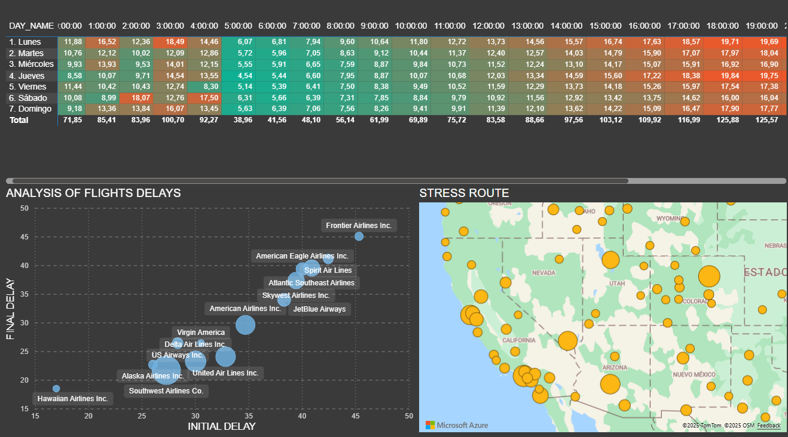
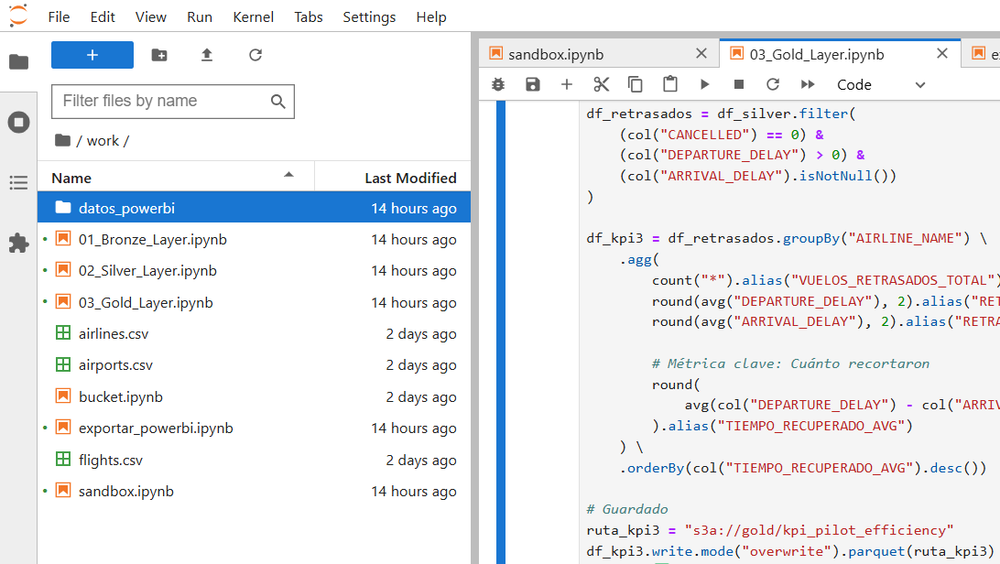
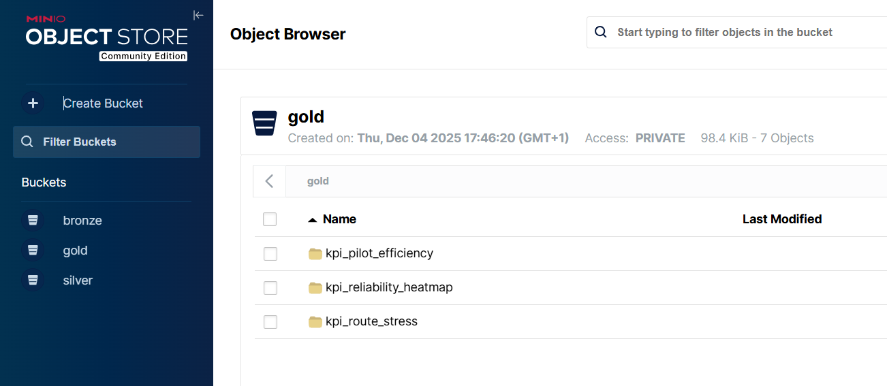

**🛫 Proyecto SkyTracker: Mi implementación de un Data Lakehouse End-to-End**

**Autor:** Aisha del Tio de Prado **Tecnología:** Docker, PySpark, JupyterLab, MinIO, Power BI

**1. Visión General del Proyecto**

En este proyecto, he diseñado y construido desde cero una solución completa de Ingeniería de Datos (Data Lakehouse). Mi objetivo principal ha sido procesar grandes volúmenes de datos de tráfico aéreo para transformar archivos crudos en inteligencia de negocio accionable, visualizada en un Dashboard interactivo.

Para ello, he simulado una arquitectura de Big Data real utilizando contenedores y un entorno de desarrollo profesional, **replicando la experiencia de trabajar en plataformas empresariales como Databricks**, asegurando que el proyecto sea modular y escalable.

**2. Mi Stack Tecnológico**

Para garantizar la portabilidad y la eficiencia del entorno, he seleccionado las siguientes herramientas:

- **Infraestructura:** Desplegué todo el ecosistema sobre **Docker** y **Docker Compose**, lo que me permitió levantar servicios complejos (Spark y MinIO) con un solo comando.
- **Entorno de Desarrollo (IDE):** Utilicé **JupyterLab** para escribir y ejecutar mi código. Esto me permitió simular el flujo de trabajo de **Databricks**, trabajando con Notebooks interactivos para prototipar, limpiar datos y documentar el proceso paso a paso antes de pasarlo a producción.
- **Procesamiento:** Utilicé **Apache Spark (PySpark)** como motor principal por su capacidad de procesamiento distribuido y manejo de grandes volúmenes de datos.
- **Almacenamiento:** Implementé **MinIO** para simular un almacenamiento de objetos tipo S3 (Cloud), creando un Data Lake real.
- **Visualización:** Conecté **Microsoft Power BI** para la capa de presentación final.

**3. Arquitectura de Datos: Mi Enfoque "Medallion"**

Estructuré el flujo de datos en tres capas lógicas para refinar la información progresivamente:

**🥉 Capa Bronze (Ingesta y Formato)**

Mi primer paso fue la ingesta de los datos crudos (flights.csv, airlines.csv, airports.csv).

- **Decisión técnica:** Decidí no trabajar con los CSVs directamente en las siguientes fases. En su lugar, convertí todo a formato **Parquet**.
- **¿Por qué?** Para optimizar el rendimiento de lectura en Spark y reducir el espacio en disco gracias a la compresión columnar.

**🥈 Capa Silver (Limpieza y Enriquecimiento)**

Aquí es donde realicé la mayor carga de ingeniería. Mi objetivo fue crear una **Tabla Maestra** unificada.

- **El Reto de los Joins:** Me encontré con la necesidad de cruzar la tabla de vuelos con la de aeropuertos *dos veces* (una para el origen y otra para el destino).
- **Mi Solución:** Utilicé **Alias** en Spark (df.alias("origen") y df.alias("destino")). Esto me permitió enriquecer cada vuelo con las coordenadas geográficas de salida y llegada sin generar conflictos de nombres en las columnas.
- **Gestión de Calidad del Dato (Data Quality):** Detecté que el dataset contenía códigos de aeropuerto numéricos (ej. 10135) que no cumplían el estándar IATA y generaban valores nulos. Implementé un filtro estricto (length == 3) antes de los cruces para garantizar la integridad de la Tabla Maestra.
- **Feature Engineering:** Creé nuevas variables de negocio, como transformar la hora numérica en franjas horarias (DEPARTURE\_HOUR) y los días de la semana en nombres legibles (DAY\_NAME), aplicando la filosofía *"Write Once, Read Many"* (procesar una vez en Silver para facilitar múltiples lecturas en Gold).

**🥇 Capa Gold (Agregaciones de Negocio)**

En esta etapa final, dejé de lado el detalle vuelo a vuelo para centrarme en responder preguntas de negocio mediante agregaciones (KPIs). Generé tres tablas específicas:

- **Heatmap de Fiabilidad:** Calculé el retraso medio por día y hora. Afiné la lógica para que los adelantos (tiempo negativo) contaran como 0, evitando que "maquillaran" los datos de retraso real.
- **Estrés de Rutas:** Agrupé los datos por par Origen-Destino, conservando las coordenadas geográficas para poder proyectar el tráfico en mapas.
- **Eficiencia de Pilotos:** Filtré solo los vuelos con retraso inicial para medir qué aerolíneas son capaces de recuperar tiempo en el aire (Departure - Arrival), identificando la eficiencia operativa real.

**4. Retos Superados y Soluciones**

Durante el desarrollo, me enfrenté a varios obstáculos técnicos que resolví de la siguiente manera:

- **Integración Power BI - MinIO:** Power BI no podía interpretar los metadatos internos de MinIO (xl.meta). Para solucionarlo, desarrollé un script de exportación en Spark que vuelca los datos de la capa Gold desde el sistema distribuido a una carpeta local mapeada, generando archivos Parquet estándar legibles por Windows.
- **Lectura de Particiones:** Spark divide los datos en múltiples archivos (part-00000...). Aprendí a utilizar el conector de "Carpeta" en Power BI, aplicando filtros de extensión para ignorar archivos de control como \_SUCCESS y combinando los binarios correctamente.
- **Manejo de Nulos en Visualización:** Al principio, mi mapa mostraba valores nulos. Tras auditar los datos en mi **Notebook de pruebas (Sandbox) en JupyterLab**, identifiqué la inconsistencia de los códigos numéricos y apliqué la limpieza en la capa Silver, logrando una visualización geográfica completa.

**5. Conclusión**

Este proyecto me ha permitido consolidar mis conocimientos en el ciclo de vida completo del dato. He pasado de tener archivos dispersos a construir un **Data Pipeline robusto, automatizado e idempotente**, capaz de alimentar un cuadro de mando profesional que permite tomar decisiones basadas en datos reales, utilizando herramientas estándar de la industria.

